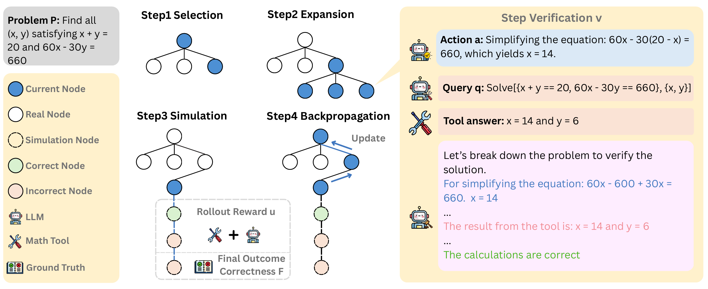

<div align="center">

#  GroundedPRM: Tree-Guided and Fidelity-Aware Process Reward Modeling for Step-Level Reasoning

[](https://arxiv.org/abs/2510.14942)
[](LICENSE)
[](https://www.python.org/downloads/)

<p align="center">
  <em>A tree-guided, fidelity-aware PRM that fuses MCTS credit assignment with external step verification to yield verifiable, attribution-aligned step rewards; trained on ~40K auto-labeled samples and outperforming human-labeled PRMs in reward-guided search.</em>
</p>

</div>

## 🧠 Abstract

Process Reward Models (PRMs) aim to improve multi-step reasoning in Large Language Models (LLMs) by supervising intermediate steps and identifying reasoning errors.  However, existing PRMs suffer from **noisy rewards**, **low factual fidelity**, and **weak step-level alignment** due to reliance on hallucinated or Monte Carlo-based signals.

**GroundedPRM** introduces a **tree-guided and fidelity-aware framework** that integrates:

1. **Monte Carlo Tree Search (MCTS)**: for structured reasoning path construction and step-level credit assignment.
2. **External tool verification**: each intermediate step is validated by a math tool (e.g., Wolfram Alpha or SymPy).
3. **Hybrid reward aggregation**: combines step-level correctness and final outcome fidelity.
4. **Rationale-enhanced supervision**: each reward is paired with a natural-language justification for interpretability.

Trained on only **40K automatically labeled samples** (≈10% of baseline data), GroundedPRM achieves **26% relative improvement** on *ProcessBench* and even surpasses human-labeled PRMs in reward-guided search.

## 📊 Overview

<div align="center">
  
</div>

**Figure 1.** Overview of the GroundedPRM framework. GroundedPRM constructs reasoning paths via
MCTS, where each node corresponds to an LLM-generated step. During simulation, intermediate
steps are verified using an external tool, and final answers are checked against ground truth. Step-level
and outcome-level correctness signals are aggregated into a rollout reward, which is backpropagated
along the tree to update node statistics; the next node is then selected by UCT, continuing the MCTS
search until convergence or budget exhaustion. The framework enables verifiable, interpretable,
and structure-aware process supervision for multi-step reasoning. The generative rationale provides
interpretable feedback for each step.

## ⚙️ Methodology Summary

| Component | Description |
|------------|-------------|
| **Tree-Guided Construction** | MCTS explores reasoning paths; each node is an LLM-generated step |
| **External Verification** | Steps validated by Wolfram Alpha/SymPy for correctness |
| **Hybrid Reward** | Combines step correctness + final answer accuracy |
| **Generative PRM** | Outputs correctness label + natural language rationale |
| **Data Construction** | 40K verified samples from MATH dataset via MCTS + tool verification |

## 🧪 Experimental Results

### 📊 ProcessBench

| Model | #Samples | GSM8K | MATH | OlympiadBench | Omni-MATH | Avg. |
|:------|:--------:|:-----:|:----:|:-------------:|:---------:|:----:|
| RLHFlow-DeepSeek-8B | 253K | 38.8 | 33.8 | 16.9 | 16.9 | 26.6 |
| RLHFlow-Mistral-8B | 273K | 50.4 | 33.4 | 13.8 | 15.8 | 28.4 |
| Qwen2.5-Math-7B-Math-Shepherd∗ | 445K | 62.5 | 31.6 | 13.7 | 7.7 | 28.9 |
| EurusPRM-Stage1∗ | 453K | 44.3 | 35.6 | 21.7 | 23.1 | 31.2 |
| EurusPRM-Stage2∗ | 230K | 47.3 | 35.7 | 21.2 | 20.9 | 31.3 |
| Math-Shepherd-PRM-7B | 445K | 47.9 | 29.5 | 24.8 | 23.8 | 31.5 |
| **GroundedPRM (ours)** | **40K** | **43.4** | **47.0** | **33.8** | **34.4** | **39.7** |


> ✅ **GroundedPRM** achieving a **26% relative improvement** over the second-best model, Math-Shepherd-PRM-7B, using **only 10% of automatically labeled** training samples.

### 🎯 Reward-Guided Greedy Search 

| Model | Supervision | AMC23 | AIME24 | MATH | College | Oly. | Minerva | Avg. |
|:------|:------------:|:-----:|:------:|:----:|:-------:|:----:|:-------:|:----:|
| Qwen2.5-Math-7B-PRM800K | Human | 60.0 | 10.0 | 75.6 | 36.5 | 23.5 | 29.0 | 39.1 |
| Llemma-PRM800K-7B | Human | 42.5 | 6.7 | 72.2 | 47.5 | 27.6 | 29.5 | 37.7 |
| ReasonEval-7B | Human | 52.5 | 6.7 | 76.0 | 33.8 | 33.8 | 30.0 | 41.9 |
| Math-PSA-7B | Mix | 47.5 | 13.3 | 69.8 | 46.0 | 27.6 | 33.5 | 39.6 |
| Math-Shepherd-PRM-7B | Auto | 45.0 | 10.0 | 74.8 | 48.5 | 28.0 | 29.0 | 39.2 |
| RLHFlow-DeepSeek-8B | Auto | 50.0 | 6.7 | 74.2 | 48.0 | 30.9 | 27.5 | 39.5 |
| RLHFlow-Mistral-8B | Auto | 37.5 | 13.3 | 74.8 | 50.5 | 29.8 | 30.0 | 39.3 |
| EurusPRM-Stage1 | Auto | 47.5 | 10.0 | 73.0 | 49.0 | 30.1 | 31.0 | 40.1 |
| EurusPRM-Stage2 | Auto | 45.0 | 13.3 | 73.6 | 51.0 | 31.6 | 32.5 | 41.1 |
| **GroundedPRM (ours)** | Auto | **57.5** | **10.0** | **74.8** | **49.0** | **31.3** | **32.5** | **42.4** |

> ✅  **GroundedPRM** achieves the highest average accuracy among all PRMs, and even surpasses models trained with human or mixed annotations.

## 🚀 Get Started

### 1️⃣ Environment Setup

```bash
conda create -n groundedprm python=3.10
conda activate groundedprm
pip install -r requirements.txt
```

**Configure API endpoints:**

1. Create a `config.py` file from the template:
```bash
cp config.example.py config.py
```

2. Update `config.py` with your API endpoints and model names:
```python
QWEN_API_URL = "http://your-qwen-api:8001/v1/chat/completions"
QWEN_MODEL_NAME = "your-qwen-model-name"
DEEPSEEK_API_URL = "http://your-deepseek-api:8000/v1/chat/completions"
DEEPSEEK_MODEL_NAME = "your-deepseek-model-name"
```

**Deploy model API (example using vLLM):**
```bash
python -m vllm.entrypoints.openai.api_server \
    --model Qwen/Qwen2.5-7B-Instruct \
    --port 8001
```

### 2️⃣ Data Generation

The MCTS-based data generation pipeline is in `pipeline/`.

1. **Deploy your model API**, e.g.:
   - `Qwen2.5-7B-Instruct`
   - `Deepseek-Distill-Qwen-32B`
2. **Generate root nodes:**
   ```bash
   cd pipeline
   python root_generation.py
   ```
3. **Configure API in** `models/model.py`  
   (set endpoint and key)
4. **Run data generation:**
   ```bash
   python data_generation.py \
       --outputs_dir outputs/state_trace \
       --root_dir pipeline/outputs/root \
       --task_file root.json \
       --start_index 0 \
       --max_workers 40
   ```
   
   **Parameters:**
   - `--outputs_dir`: Where to save MCTS traces
   - `--max_workers`: Parallel workers (adjust based on CPU cores)

### 3️⃣ Data Processing

1. **Extract data samples from the tree:**
   ```bash
   cd data_process
   python extract_path.py
   ```

2. **Prepare training data for llama-factory:**
   ```bash
   cd data_process
   python construct.py
   ```

This produces verified JSON traces ready for **LLaMA-Factory** fine-tuning (LoRA/PEFT supported).

### 4️⃣ Model Training

We use [LLaMA-Factory](https://github.com/hiyouga/LLaMA-Factory) for training.

```bash
# Install LLaMA-Factory
pip install llamafactory

# Train with LoRA
llamafactory-cli train \
    --stage sft \
    --model_name_or_path Qwen/Qwen2.5-7B-Instruct \
    --dataset your_dataset \
    --template qwen \
    --finetuning_type lora \
    --output_dir models/GroundedPRM \
    --per_device_train_batch_size 4 \
    --learning_rate 5e-5 \
    --num_train_epochs 3 \
    --fp16

# Merge LoRA weights
llamafactory-cli export \
    --model_name_or_path Qwen/Qwen2.5-7B-Instruct \
    --adapter_name_or_path models/GroundedPRM \
    --export_dir models/GroundedPRM-merged
```

See [LLaMA-Factory docs](https://github.com/hiyouga/LLaMA-Factory) for dataset format details.

### 5️⃣ Evaluation

#### 🔹 ProcessBench

```bash
python evaluation/ProcessBench_eval.py
```

#### 🔹 Reward-Guided Search

```bash
# Deploy PRM API first
cd evaluation/reward_guided_search
bash deploy_models.sh  # Edit to set your model path

# Run evaluation
bash reward_guided_search_eval_api.sh
```

**Datasets:** AMC23, AIME24, MATH, College Math, OlympiadBench, Minerva Math


## 📁 Repository Structure

```
GroundedPRM/
├── pipeline/                   # MCTS-based data generation
│   ├── root_generation.py      # Generate initial problem states
│   ├── data_generation.py      # Main MCTS generation script
│   ├── MCTS/                   # MCTS core implementation
│   ├── models/                 # LLM API configuration
│   └── utils/                  # Math verification & utilities
│
├── data_process/               # Data post-processing
│   ├── extract_path.py         # Extract trajectories from tree
│   └── construct.py            # Build training dataset
│
├── evaluation/                 # Evaluation scripts
│   ├── ProcessBench_eval.py    # ProcessBench evaluation
│   └── reward_guided_search/   # Reward-guided search eval
│
├── assets/                     # Images and resources
├── config.example.py           # Configuration template
├── LICENSE                     # Apache 2.0 License
├── requirements.txt
└── README.md
```

## 📈 Citation

If you find this work relevant or helpful to your work, please kindly cite us:

```bibtex
@misc{zhang2025groundedprmtreeguidedfidelityawareprocess,
      title={GroundedPRM: Tree-Guided and Fidelity-Aware Process Reward Modeling for Step-Level Reasoning},
      author={Yao Zhang and Yu Wu and Haowei Zhang and Weiguo Li and Haokun Chen and Jingpei Wu and Guohao Li and Zhen Han and Volker Tresp},
      year={2025},
      eprint={2510.14942},
      archivePrefix={arXiv},
      primaryClass={cs.AI},
      url={https://arxiv.org/abs/2510.14942}
}
```

## 🙏 Acknowledgements

Evaluation components reference:
- [ProcessBench](https://github.com/QwenLM/ProcessBench)
- [PathFinder-PRM](https://github.com/declare-lab/PathFinder-PRM)

## 📜 License

This project is licensed under the Apache 2.0 License - see [LICENSE](LICENSE) file for details.
